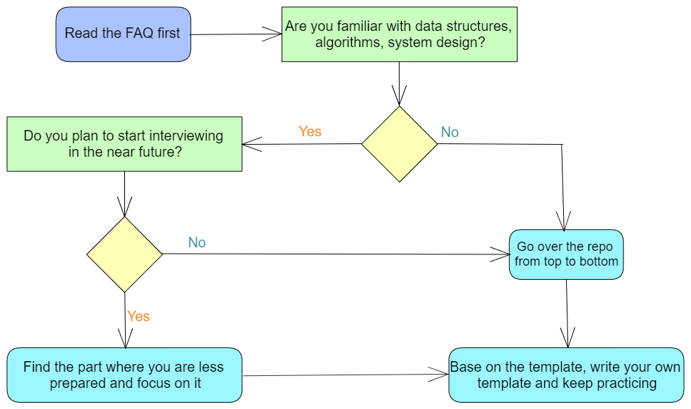
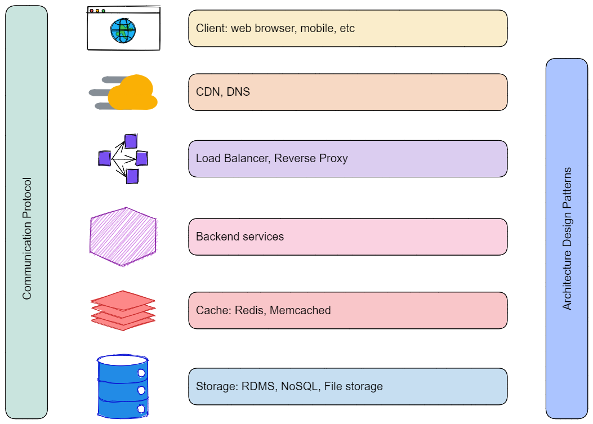

# The Coding Interview Guide

> This is a collection of my notes when I was/am studying for interviews (or just for learning) 
> and it is also intended to become a systematic guide for people who would like to 
> become a software development engineer (SDE).

> I was graduated as an Electrical Engineer and after worked 1.5 years as an Electrical
> Engineer I decided to switch to the programming world. I only had one programming course 
> at university and I have taught myself all the most common data structures and
> algorithms, machine learning fundamentals, and software architectures. I started working 
> on leetcode problems at end of Feb 2020, and since then I solve at least 1 problem 
> everyday.

> During my learning journey, I found that I learned all the knowledge piece by piece 
> when I need them, but I was always lack of a systematic understanding/overview. Since 
> I made lots of notes during study, I think its necessary to summarize them and make 
> them a systematic guide for whoever wants to become a software development engineer.

> Hope this repo is helpful and best of luck to you!

## Preface 1: How to use this repo

In this repo I'm going to show you how to get started for those who want to switch career, 
to improve the interviewing technics, or to revisit the fundamentals.

- I'll build a systematic path for data structures, algorithms, and system design problems
- I'll be sharing the tips and tricks on how to practice for the algorithms
- I'll be sharing the technics for answering Behavior Questions (BQs)
- I'll be giving resources that I learnt 
- MAKE SURE YOU READ THE [QA SECTION](#appendix-1-question--answer)

Most importantly, learning is a life long journey, and I'm still learning everyday.
Hopefully you can learn with me, and I can help people getting into the field more easily
or improving their technical abilities.

***How to use this repo:***

Basically, you should use this repo as a guide (yeah the name kinda indicates) to build your own knowledge base and templates.

And if you have enough time, you should go over every topics. If not you can just read the topics you are interested.

## Preface 2: Before get started, REMEMBER the following facts

- **Programming is about writing the code, not reading**. So don't just read, IMPLEMENT it!
- **You can't memorize everything at the first time**. So keep repeating and practicing, and WRITE them down!
- **Don't feel you aren't smart enough**. In fact a lot of programming questions are tricky since you've never seen them before. Once you've seen enough, you'll know the tricks.
- **Review, review, review**. Review your code and your notes once a while, try to refactor/optimize your code, and refresh your memories about the fundamentals.
- **Learning is a life lon journey**. So keep learning and reading!

Above points are really really important, keep these in mind and they'll help you in your career.

Now let's begin our journey!

## Table of Content

- [The Coding Interview Guide](#the-coding-interview-guide)
  - [Preface 1: How to use this repo](#preface-1-how-to-use-this-repo)
  - [Preface 2: Before get started, REMEMBER the following facts](#preface-2-before-get-started-remember-the-following-facts)
  - [Table of Content](#table-of-content)
  - [Section 1: Data Structures and Algorithms](#section-1-data-structures-and-algorithms)
    - [Chapter 1: Data Structures](#chapter-1-data-structures)
      - [1.1 Array](#11-array)
      - [1.2 Linked List](#12-linked-list)
      - [1.3 Stack](#13-stack)
        - [1.3.1 Arithmetic Expressions](#131-arithmetic-expressions)
      - [1.4 Queue](#14-queue)
      - [1.5 Hash Table](#15-hash-table)
      - [1.6 Trees](#16-trees)
        - [1.6.1 Tree Traversal: access the nodes of the tree](#161-tree-traversal-access-the-nodes-of-the-tree)
        - [1.6.2 Binary Search Tree (BST)](#162-binary-search-tree-bst)
        - [1.6.3 Heap / Priority Queue / Binary Heap](#163-heap--priority-queue--binary-heap)
        - [1.6.4 More Trees](#164-more-trees)
      - [1.7 Graph](#17-graph)
        - [1.7.1 Vocabulary and Definitions](#171-vocabulary-and-definitions)
        - [1.7.2 Graph Representation](#172-graph-representation)
        - [1.7.3 Graph Algorithms](#173-graph-algorithms)
    - [Chapter 2: Common Algorithm Types](#chapter-2-common-algorithm-types)
      - [2.1 Brute Force](#21-brute-force)
      - [2.2 Search](#22-search)
        - [2.2.1 Sequential Search](#221-sequential-search)
        - [2.2.2 Binary Search](#222-binary-search)
      - [2.3 Sort](#23-sort)
        - [2.3.1 Bubble Sort](#231-bubble-sort)
        - [2.3.2 Selection Sort](#232-selection-sort)
        - [2.3.3 Insertion Sort](#233-insertion-sort)
        - [2.3.4 Shell Sort](#234-shell-sort)
        - [2.3.5 Merge Sort](#235-merge-sort)
        - [2.3.6 Quick Sort](#236-quick-sort)
        - [2.3.7 Heap Sort](#237-heap-sort)
      - [2.4 Recursion](#24-recursion)
        - [2.4.1 Recursive function in Python](#241-recursive-function-in-python)
      - [2.5 Backtracking](#25-backtracking)
      - [2.6 Dynamic Programming](#26-dynamic-programming)
      - [2.7 Divide and Conquer](#27-divide-and-conquer)
      - [2.8 Greedy](#28-greedy)
      - [2.9 Branch and Bound](#29-branch-and-bound)
    - [Chapter 3: Frequently Used Technics and Algorithms](#chapter-3-frequently-used-technics-and-algorithms)
      - [3.1 Must know for interview](#31-must-know-for-interview)
      - [3.2 Good to know but can be skipped](#32-good-to-know-but-can-be-skipped)
    - [Summary](#summary)
  - [Section 2: System Design](#section-2-system-design)
    - [Chapter 4: System Design Interview Template](#chapter-4-system-design-interview-template)
    - [Chapter 5: System Design Components](#chapter-5-system-design-components)
    - [Chapter 6: Classic Designs](#chapter-6-classic-designs)
    - [Chapter 7: System Design Case Study](#chapter-7-system-design-case-study)
  - [Section 3: Transferrable Skills and Offer](#section-3-transferrable-skills-and-offer)
    - [Chapter 8: Behavioral Questions (BQ)](#chapter-8-behavioral-questions-bq)
      - [8.1 Four things to remember for the BQ](#81-four-things-to-remember-for-the-bq)
      - [8.2 How to prepare for BQ](#82-how-to-prepare-for-bq)
    - [Chapter 9: Offer Negotiation](#chapter-9-offer-negotiation)
  - [Appendix 1: Question & Answer](#appendix-1-question--answer)
    - [A1.1 Technical Questions](#a11-technical-questions)
      - [A1.1.1 How to use LeetCode as a beginner](#a111-how-to-use-leetcode-as-a-beginner)
      - [A1.1.2 How to solve LeetCode problem EFFECTIVELY](#a112-how-to-solve-leetcode-problem-effectively)
      - [A1.1.3 How to solve LeetCode problem EFFICIENTLY](#a113-how-to-solve-leetcode-problem-efficiently)
      - [A1.1.4 Pay close attention to these when solving problem (gain max value of leetcode problem)](#a114-pay-close-attention-to-these-when-solving-problem-gain-max-value-of-leetcode-problem)
      - [A1.1.5 Why you should use a template for the algorithm and data structures](#a115-why-you-should-use-a-template-for-the-algorithm-and-data-structures)
      - [A1.1.6 What should I do if I lost confident when practicing leetcode](#a116-what-should-i-do-if-i-lost-confident-when-practicing-leetcode)
      - [A1.1.7 I still can't solve new problems even if I finished x number of problems on LeetCode](#a117-i-still-cant-solve-new-problems-even-if-i-finished-x-number-of-problems-on-leetcode)
    - [A1.2 Interview Questions](#a12-interview-questions)
      - [A1.2.1 What's the interview process look like](#a121-whats-the-interview-process-look-like)
      - [A1.2.2 How to write an effective resume](#a122-how-to-write-an-effective-resume)
      - [A1.2.3 I have applied to many jobs but still no interview](#a123-i-have-applied-to-many-jobs-but-still-no-interview)
      - [A1.2.4 How to solve an algorithm/data structure problem in interview](#a124-how-to-solve-an-algorithmdata-structure-problem-in-interview)
    - [A1.3 General Questions](#a13-general-questions)
      - [A1.3.1 Large Company VS Small Company](#a131-large-company-vs-small-company)
      - [A1.3.2 How to get your FIRST job! (How to become more competitive among the candidates)](#a132-how-to-get-your-first-job-how-to-become-more-competitive-among-the-candidates)
  - [Appendix 2: Resources](#appendix-2-resources)
    - [A2.1 Learning Experience](#a21-learning-experience)
      - [A2.1.1 Online MOOC courses](#a211-online-mooc-courses)
    - [A2.2 How to solve Algorithm Questions](#a22-how-to-solve-algorithm-questions)
    - [A2.3 OOD (Object Oriented Design)](#a23-ood-object-oriented-design)
      - [A2.3.1 SOLID Principals](#a231-solid-principals)
      - [A2.3.2 Clean Code - Uncle Bob lessons](#a232-clean-code---uncle-bob-lessons)
    - [A2.4 Design Patterns](#a24-design-patterns)
    - [A2.5 Async in Python](#a25-async-in-python)
    - [A2.6 System Design](#a26-system-design)
    - [A2.7 Machine Learning](#a27-machine-learning)
    - [A2.8 Reinforcement Learning](#a28-reinforcement-learning)
  - [Postface](#postface)

---

## Section 1: Data Structures and Algorithms

**Book:** [Problem Solving with Algorithms and Data Structures using Python](https://runestone.academy/runestone/books/published/pythonds/index.html)

- For those who needs to study the fundamental data structures and algorithms, highly recommend to go over above textbook thoroughly first, and then come back to the following content, or practice on Leetcode or other platform

**Basic data structures**:

- Array
- Linked List
- Stack
- Queue
- Hash Table
- Tree
- Graph

**Common Algorithm Types**:

- Brute Force
- Search and Sort
- Recursive
- Backtracking 
- Dynamic Programming
- Divide and Conquer
- Greedy
- Branch and Bound

**Big O Notations**:

- It is critical that you understand and are able to calculate the Big O for the code you wrote.
- **The order of magnitude function describes the part of T(n) that increases the fastest as the value of n increases. Order of magnitude is often called Big-O notation (for “order”) and written as O(f(n)).**  

- Basically, the Big O measures the number of assignment statements

    | f(n)    | Name        |
    | :-----  | :----       |
    | 1       | Constant    |
    | log n   | Logarithmic |
    | n       | Linear      |
    | n log n | Log Linear  |
    | n^2     | Quadratic   |
    | n^3     | Cubic       |
    | 2^n     | Exponential |

    

### Chapter 1: Data Structures

#### 1.1 Array

- An array (in Python its called *list*) is a collection of items where each item holds a relative position with respect to the others.

#### 1.2 Linked List

- Similar to array, but requires O(N) time on average to visit an element by index
- Linked list utilize memory better than array, since it can use discrete memory space, whereas array must use continuous memory space
- [Details and Templates](./Templates/linked_list.md)

#### 1.3 Stack

- Stacks are fundamentally important, as they can be used to reverse the order of items. 
- The order of insertion is the reverse of the order of removal.
- Stack maintain a FILO (first in last out) ordering property.
- When pop is called on the end of the list it takes O(1) but when pop is called on the first element in the list or anywhere in the middle it is O(n) (in Python).

##### 1.3.1 Arithmetic Expressions

- Infix: the operator is in between the two operands that it is working on (i.e. A+B)    
	- Fully Parenthesized expression: uses one pair of parentheses for each operator. (i.e.  ((A + (B * C)) + D))
- Prefix: all operators precede the two operands that they work on (i.e. +AB)
- Postfix: operators come after the corresponding operands (i.e. AB+)    

| Infix Expression  | Prefix Expression | Postfix Expression |
| ----------------- | ----------------- | ------------------ |
| A + B             | + A B             | A B +              |
| A + B * C         | + A * B C         | A B C * +          |
| (A + B) * C       | * + A B C         | A B + C *          |
| A + B * C + D     | + + A * B C D     | A B C * + D +      |
| (A + B) * (C + D) | * + A B + C D     | A B + C D + *      |
| A * B + C * D     | + * A B * C D     | A B * C D * +      |
| A + B + C + D     | + + + A B C D     | A B + C + D +      |

- **NOTE:**
	- Only infix notation requires parentheses to determine precedence
	- The order of operations within prefix and postfix expressions is completely determined by the position of the operator and nothing else

#### 1.4 Queue

- A queue is structured as an ordered collection of items which are added at one end, called the “rear,” and removed from the other end, called the “front.” 
- Queues maintain a FIFO ordering property.
- A ***deque***, also known as a double-ended queue, is an ordered collection of items similar to the queue. 
    - It has two ends, a front and a rear, and the items remain positioned in the collection. 
    - New items can be added at either the front or the rear. 
    - Likewise, existing items can be removed from either end.

#### 1.5 Hash Table

- A **hash table** is a collection of items which are stored in such a way as to make it easy to find them later. 
- Each position of the hash table, often called a slot, can hold an item and is named by an integer value starting at 0.
- The mapping between an item and the slot where that item belongs in the hash table is called the **hash function**.
	- **Remainder method** takes an item and divides it by the table size, returning the remainder as its hash value (i.e. `h(item) = item % 11`)
	- **load factor** is the number of items divided by the table size
	- **collision** refers to the situation that multiple items have the same hash value
	- **folding method** for constructing hash functions begins by dividing the item into equal-size pieces (the last piece may not be of equal size). These pieces are then added together to give the resulting hash value. 
	- **mid-square method** first squares the item, and then extract some portion of the resulting digits. For example, 44^2 = 1936, extract middle two digits 93, then perform remainder step (93%11=5).
- **Collision Resolution** is the process to systematically place the second item in the hash table when two items hash to the same slot.
- **Open addressing (linear probing):** sequentially find the next open slot or address in the hash table 
	- A disadvantage to linear probing is the tendency for clustering; items become clustered in the table.
	- **Rehashing** is one way to deal with clustering, which is to skip the slot when looking  sequentially for the next open slot, thereby more evenly distributing the items that have caused collisions.
- **Quadratic probing:** instead of using a constant “skip” value, we use a rehash function that increments the hash value by 1, 3, 5, 7, 9, and so on. This means that if the first hash value is h, the successive values are h+1, h+4, h+9, h+16, and so on.
- **Chaining** allows many items to exist at the same location in the hash table. 
	- When collisions happen, the item is still placed in the proper slot of the hash table. 
	- As more and more items hash to the same location, the difficulty of searching for the item in the collection increases.    
	
- The initial size for the hash table has to be a prime number so that the collision resolution algorithm can be as efficient as possible.

#### 1.6 Trees

* A tree data structure has its root at the top and its leaves on the bottom.
* Three properties of tree:
    1. we start at the top of the tree and follow a path made of circles and arrows all the way to the bottom.
    2. all of the children of one node are independent of the children of another node.
    3. each leaf node is unique. 
* **binary tree:** each node in the tree has a maximum of two children.
    * A **balanced binary tree** has roughly the same number of nodes in the left and right subtrees of the root.

##### 1.6.1 Tree Traversal: access the nodes of the tree

- Tree traversal is the foundation of all tree related problems.
- Here are a few different ways to traverse a tree:
    - BFS: Level-order
    - DFS: Pre-order, In-order, Post-order
    - [Details and Templates](./Templates/tree_traversal.md)

##### 1.6.2 Binary Search Tree (BST)

- BST Property (left subtree < root < right subtree):
    1. The value in each node must be `greater than (or equal to)` any values stored in its left subtree.
    2. The value in each node must be `less than (or equal to)` any values stored in its right subtree.
- `Inorder traversal` in BST will be in `ascending order`. Therefore, the inorder traversal is the most frequent used traversal method of a BST.
- **successor:** the node that has the next-largest key in the tree
    - it has no more than one child
- You could go over the [Leetcode Binary Search Tree topic](https://leetcode.com/explore/learn/card/introduction-to-data-structure-binary-search-tree/) for details

##### 1.6.3 Heap / Priority Queue / Binary Heap

- **Priority Queue:**
    - the logical order of items inside a queue is determined by their priority.
    - The highest priority items are at the front of the queue and the lowest priority items are at the back.
- **Binary Heap:** the classic way to implement a priority queue.
    - both enqueue and dequeue items are **O(logn)**
    - **min heap:** the smallest key is always at the front
    - **max heap:** the largest key value is always at the front
    - **complete binary tree:** a tree in which each level has all of its nodes (except the bottom level)
        - can be implemented using a single list
        - Because the tree is complete, the left child of a parent (at position **p**) is the node that is found in position **2p** in the list. Similarly, the right child of the parent is at position **2p+1** in the list.
        
    - **heap order property:** In a heap, for every node **x** with parent **p**, the key in **p** is smaller than or equal to the key in **x**.
        * For example, the root of the tree must be the smallest item in the tree
    - When to use heap:
        - Priority Queue implementation
        - whenever need quick access to largest/smallest item
            - Instant access to the item
            - insertions are fast, allow in-place sorting
        - More details can be seen in [this discussion](https://stackoverflow.com/questions/749199/when-would-i-want-to-use-a-heap)

##### 1.6.4 More Trees

- ***Parse tree*** can be used to represent real-world constructions like sentences or mathematical expressions.
    - A simple solution to keeping track of parents as we traverse the tree is to use a stack. 
    - When we want to descend to a child of the current node, we first push the current node on the stack. 
    - When we want to return to the parent of the current node, we pop the parent off the stack.
- ***AVL Tree***: a balanced binary tree. the AVL is named for its inventors G.M. Adelson-Velskii and E.M. Landis.
    - For each node: *balanceFactor* = *height(leftSubTree)* − *height(rightSubTree)*
    - a subtree is left-heavy if *balance_factor > 0*
    - a subtree is right-heavy if *balance_factor < 0*
    - a subtree is perfectly in balance if *balance_factor = 0*
    - For simplicity we can define a tree to be in balance if the balance factor is -1, 0, or 1. 
    - The number of nodes follows the pattern of *Fibonacci sequence*, as the number of elements get larger the ratio of Fi/Fi-1 closes to the golden ratio, so the time complexity is derived to be **O(log n)**
- ***Red-Black Tree***
    - [Details in Wiki](https://en.wikipedia.org/wiki/Red%E2%80%93black_tree)
- ***B+ Tree***: N-array tree
    - [Details in Wiki](https://en.wikipedia.org/wiki/B%2B_tree)
- ***Trie***
    - *This is a common data structure in interviews*
    - [Template](./Templates/trie.md)
- ***Binary Index Tree (Fenwick Tree)***
    - [Binary Index Tree (Fenwick Tree)](https://www.geeksforgeeks.org/binary-indexed-tree-or-fenwick-tree-2/)
    - [315. Count of Smaller Numbers After Self](https://leetcode.com/problems/count-of-smaller-numbers-after-self/)

#### 1.7 Graph

##### 1.7.1 Vocabulary and Definitions

- **Vertex (or Node):** the name is called "key" and the additional information is called "payload"
- **Edge (or arc):** it connects two vertices to show that there is a relationship between them. 
    - One way edge is called **directed graph (or digraph)**
- **Weight:** edges maybe weighted to show that there is a coset to fo from one vertex to another.
- **Path:** a sequence of vertices that are connected bny edges
    - Unweighted path length is the number of edges in the path, specifically n-
    - Weighted path is the sum of the weights of all the edges in the path
- **Cycle:** a path that starts and ends at the same vertex
    - A graph with no cycles is called an **acyclic graph**. 
    - A directed graph with no cycles is called a **directed acyclic graph (or DAG)**
- **Graph:** a graph (G) is composed with a set of vertices (V) and edges (E) Each edge is a tuple of vertex and weight (v,w). G=(V,E) where w,v∈V

##### 1.7.2 Graph Representation

- Adjacency Matrix (2D matrix)
    - Good when number of edges is large
    - Each of the rows and columns represent a vertex in the graph. 
    - The value in the cell at the intersection of row v and column w indicates if there is an edge from vertex v to vertex w. It also represents the weight of the edge from vertex v to vertex w.
    - When two vertices are connected by an edge, we say that they are **adjacent**
        
    - **sparse:** most of the cells in the matrix are empty
- Adjacency List
    - space-efficient way for implementation
    - keep a master list of all the vertices in the Graph object. each vertex is an element of the list with the vertex as ID and a list of its adjacent vertices as value
        

##### 1.7.3 Graph Algorithms

- Graph traversal: BFS & DFS
    - [Template](./Templates/graph_traversal.md)
- Graph Algorithms:
    - Shortest Path:
        - Dijkstra’s Algorithm (Single source point)
            - ***Essentially, this is a BFS using priority queue instead of queue***
            - [Template](./Templates/dijkstra.md)
        - Floyd Warshall Algorithm (Multiple source point)
    - Topological Sort
        - [Template](./Templates/topological_sort.md)
    - Strongly Connected Components
        - [More Info](./Templates/graph_SCC.md)
    - Prim’s Spanning Tree Algorithm
        - [More Info](./Templates/prim_spanning_tree.md)

### Chapter 2: Common Algorithm Types

#### 2.1 Brute Force

- Most common algorithm
- Whenever you are facing a problem without many clues, you should solve it using brute force first, and observe the process and try to optimize your solution 

#### 2.2 Search

##### 2.2.1 Sequential Search

- Sequential Search: visit the stored value in a sequence (use loop)

##### 2.2.2 Binary Search

- Examine the middle item of an ordered list
- KEY is the search interval
- [Template](./Templates/binary_search.md)

#### 2.3 Sort

##### 2.3.1 Bubble Sort

- Compares adjacent items and exchanges those that are out of order.
- **Short bubble:** stop early if it finds that the list has become sorted.
- time complexity: O(n2)

##### 2.3.2 Selection Sort

- Looks for the largest value as it makes a pass and, after completing the pass, places it in the proper location.
- time complexity: O(n2)

##### 2.3.3 Insertion Sort

- Maintains a sorted sub-list in the lower positions of the list. 
- Each new item is then “inserted” back into the previous sub-list such that the sorted sub-list is one item larger.
- time complexity: O(n2)

##### 2.3.4 Shell Sort

- Breaks the original list into a number of smaller sub-lists, each of which is sorted using an insertion sort. 
	- the shell sort uses an increment *i*, sometimes called the **gap**, to create a sub-list by choosing all items that are *i* items apart.
	- After all the sub-lists are sorted, it finally does a standard insertion sort
	- time complexity goes between O(n) and O(n2), by changing the increment, a shell sort can perform at O(n^(3/2)).

##### 2.3.5 Merge Sort

- A recursive algorithm that continually splits a list in half. 
- [Details and Templates](./Templates/merge_sort.md)

##### 2.3.6 Quick Sort

- First selects a value (**pivot value**), and then use this value to assist with splitting the list. 
- [Details and Templates](./Templates/quick_sort.md)

##### 2.3.7 Heap Sort

- Use the property of heap to sort the list

#### 2.4 Recursion

**Recursion** is a method of solving problems that involves breaking a problem down into smaller and smaller sub-problems until you get to a small enough problem that it can be solved trivially. Usually recursion involves a function calling itself.

Three Laws of Recursion:

1. A recursive algorithm must have a base case.
2. A recursive algorithm must change its state and move toward the base case.
3. A recursive algorithm must call itself, recursively.

Recursive visualization: Fractal tree

- A **fractal** is something that looks the same at all different levels of magnification.
- A fractal tree: a small twig has the same shape and characteristics as a whole tree. 

##### 2.4.1 Recursive function in Python

* When a function is called in Python, a stack frame is allocated to handle the local variables of the function. 
* When the function returns, the return value is left on top of the stack for the calling function to access. 
* Even though we are calling the same function over and over, each call creates a new scope for the variables that are local to the function.

#### 2.5 Backtracking 

- a general algorithm for finding all (or some) solutions to constraint satisfaction problems (i.e. chess, puzzles, crosswords, verbal arithmetic, Sudoku, etc)
- [Template](./Templates/backtrack.md)

#### 2.6 Dynamic Programming

**Dynamic Programming (DP)** is an algorithm technique which is usually based on a recurrent formula and one (or some) starting states.
	- A sub-solution of the problem is constructed from previously found ones.
	- Usually used to find the extreme cases such as shortest path, best fit, smallest set, etc.

#### 2.7 Divide and Conquer

- **Divide**: break into non-overlapping sub-problems of the same type (of problem)
- **Conquer**: solve sub-problems
- the algorithm is to keep dividing and conquering, and finally combine them to get the solution
- the algorithm can be written in recursive or loop 

#### 2.8 Greedy

**Greedy algorithm:**

- find a safe move first
- prove safety
- solve subproblem (which should be similar to original problem)
- estimate running time

**Optimization:**

- assume everything is sorted (if not, maybe sort first)
- decide sort order
- the final running time can be O(n log n) (i.e. sort is O(log n), greedy move can be O(n))

- [More details](https://www.hackerearth.com/practice/algorithms/greedy/basics-of-greedy-algorithms/tutorial/)

#### 2.9 Branch and Bound

### Chapter 3: Frequently Used Technics and Algorithms

#### 3.1 Must know for interview

- Matrix Traversal
    - Focusing on various ways of traversing 2D matrix
    - [Template](./Templates/matrix_traversal.md)
- Sliding Window
    - ***Fundamentally this is a two pointer approach***
    - [Template](./Templates/sliding_window.md)
- Union find
    - Essentially its a list representation for the joint data points
    - [Template](./Templates/union_find.md)
- Bit Manipulation
- Prefix Sum
- monotonic stack/queue
    - [Monotonic Stack template](./Templates/monotonic_stack.md)

#### 3.2 Good to know but can be skipped

- Segment Tree
- Kadane's algorithm
- Reservoir Sampling
- Line sweep
- KMP algorithm (pattern match)
- Manacher (Longest Palindromic Substring)
- Skip List

### Summary

---

## Section 2: System Design

### Chapter 4: System Design Interview Template

System design questions can be very difficult to prepare, because it covers a  wide range of areas.

Here is a template I use for the system design interview:

1. Feature expectations (5 mins) - gather requirements:

   - Functional requirements:
       - Use cases
       - Scenarios that will NOT be covered
       - End-user (who will use it)
       - Capacity (how many people will use it, DAU (daily active user))
       - How to use it
   - None-Functional requirements:
       - Scalability
       - Availability
       - Performance/Latency
       - Consistency
       - Durability/Fault-tolerant

2. Estimations (2-5 mins) - estimate scale:

   - Throughput (QPS for read and write queries)
   - Latency expected from the system (for read and write queries)
   - Read/Write ratio (heavy read, heavy write, or similar)
   - Traffic estimates (QPS for read and write)
   - Storage estimates (media files, text/photo/video)
   - Memory estimates
       - Cache: what is the kind of data we want to store in cache
       - How much RAM and how many machines
       - How much data stored on disk/ssd

3. High Level Design (5-10 min) - discuss a very high level with the interviewer:

    - System components (load balancer, services, cache, database, etc)
    - Database schema
    - APIs for Read/Write scenarios for crucial components
    - Request flow process (from client to database)

4. Deep Dive (15-20 mins) - focus on any part of the component:

    - Scaling individual component
        - Availability, Consistency and Scale story for each component
        - Consistency and availability patterns
    - Deep dive on any of the following component
        - DNS
        - CDN (Pull vs Push vs Hybrid)
        - Load Balancer/Reverse Proxy
            - LB types
            - LB algorithms
        - Application layer scaling (Microservice, Service Discovery, Service Mesh)
        - Database (RDBMS vs NoSQL)
            - RDBMS:
                - Leader-follower, Multi-leader, Leaderless, Federation, Sharding, Denormalization, SQL Tuning
            - NoSQL:
                - Key-Value, Wide-Column, Graph, Document
                - RAM [Bounded size] => Redis, Memcached
                - AP [Unbounded size] => Cassandra, RIAK, Voldemort
                - CP [Unbounded size] => HBase, MongoDB, Couchbase, DynamoDB
        - Caches:
            - Client caching, CDN caching, Webserver caching, Database caching, Application caching, Cache at Query level, Cache at Object level
            - Cache Patterns:
                - Cache aside
                - Write through
                - Write behind
                - Refresh ahead
            - Eviction policies:
                - LRU
                - LFU
                - FIFO
        - Asynchronism
            - Message queues
            - Task queues
            - Back pressure
        - Communication
            - TCP
            - UDP
            - REST
            - RPC

5. Justify (5 mins):

    - Throughput of each layer
    - Latency caused between each layer
    - Overall latency justification

Notes:

- Treat the system design as an actual work project, for which you have to gather and clear all the requirements and then do the design, and treat your interviewer as your colleague to discuss the trade offs for your design
- Step 1 is the most important one, you'll need to know what you are about to build after all, and figure out all the requirements needed
- Step 2 should be asked, but most of the time you may be asked to design a system as a startup (i.e. you don't have many users), and then scale as you have more customers. So you don't have to give a detailed analysis at the beginning, unless is specifically asked.
- API design vs database schema design: you probably don't need to talk about both. DB design is asked more frequently in my experience.
- The key in system design is talking about trade offs, why you selected certain technologies over others and what are the draw backs.

Reference:

- [System Design Template](https://leetcode.com/discuss/career/229177/My-System-Design-Template)
- [System Design - InterviewBit](https://www.interviewbit.com/courses/system-design/)
- [SNAKE - System Design Principles to crack a system design in 5 steps \| Bowen's blog](https://bowenli86.github.io/2016/06/28/system%20design/SNAKE-System-Design-Principles-to-crack-a-system-design-in-5-steps/)

### Chapter 5: System Design Components

Network systems will eventually comes down to these components and design patterns, so it is critical to understand these components and be able to discuss design decisions and trade offs for any component.

- [Internet Protocol Suite](./SystemDesign/internet_protocol_suite.md)
    - OSI model
    - Internet protocol suite
    - TCP, UDP, QUIC, SCTP, TCP/IP
    - HTTP, HTTPS
    - socket, websocket, long-polling
    - REST, SOAP
    - HTTP response status codes
- [Load Balancer, Reverse Proxy, API Gateway](./SystemDesign/load_balancer.md)
    - LB types: layer 4 and layer 7
    - LB algorithms: least connection, least response time, least bandwidth, round robin, IP hash
    - Reverse Proxy
    - API Gateway
    - An example: The Architecture of Uber’s API gateway
- [Cache](./SystemDesign/cache.md)
    - Cache Usage Pattern
        - Cache Aside
        - Cache-as-SoR (system-of-record): Read through, write through, write behind
    - Cache Eviction Policies
    - Redis vs Memcached
- Data Store
    - Database Management Systems
        - Design Principals
            - [Replication & Partition](./SystemDesign/replication_partition.md)
                - Leader-follower replication, Sync/Async replication
                - Handling node outage
                - Replication logs
                - Eventual consistency
                - Multi-leader replication Topology, write conflict resolve
                - Leaderless replication, Quorum, sloppy quorum, hinted handoff
                - Key-value store partition
                - Local and Global index
                - Rebalancing partition
                - Coordination service, gossip protocol
            - [Transaction & Isolation](./SystemDesign/transaction_isolation.md)
                - ACID
                - Read committed 
                - Read skew
                - Snapshot isolation
                - MVCC
                - Lost update
                - Write skew
                - Phantom
                - Two-phase locking (2PL): Shared lock, exclusive lock, predicate lock, index-range lock
                - Serializable Snapshot Isolation (SSI)
            - [Consistency & Consensus](./SystemDesign/consistency_consensus.md)
                - Linearizability
                - CAP theorem
                - Causal dependency, consistent with causality, causally consistent
                - Total order, partially ordered
                - Lamport timestamp
                - Total Order Broadcast
                - Fencing token: monotonically increasing number for lock
                - epoch number: monotonically increasing number for election
                - 2PC, 3PC, XA transaction
        - Major Types
            - [RDBMS](SystemDesign/RDBMS.md)
                - Postgres vs MySQL
            - [NoSQL](./SystemDesign/nosql_db.md)
                - NoSQL database types
                - Cassandra vs MongoDB
    - [Data Storage Systems](./SystemDesign/storage_system.md)
        - File Storage
        - Block Storage
        - Object Storage
        - HDFS and Map Reduce
- Architectural Patterns

Now put them together, here is something you should know:

- [What happens when you navigate to an url](./SystemDesign/navigate_url.md)
- [How to scale web app from monolithic to distributed](./SystemDesign/scale_web_app.md)

### Chapter 6: Classic Designs

- notification system
- rate limiter
- top k problem
- distributed message queue
- distributed cache

### Chapter 7: System Design Case Study

- chat system (slack, etc)
- streaming system (youtube, etc)
- map system (google map, etc)
- booking system (ticket master, etc)
- notification system
- news feed 
- payment system
- top k (recommendation system, etc)
- url shortener
- distributed web crawler
- search auto-completion system
- file system (dropbox, google drive)

---

## Section 3: Transferrable Skills and Offer

### Chapter 8: Behavioral Questions (BQ)

#### 8.1 Four things to remember for the BQ

- Behavioral Questions have been evaluated more and more in interviews, so make sure you are well prepared before you go to an interview
- There are many many articles online talking about behavioral questions, so if you are looking for an answer to a specific question, just go ahead and search that question on Google and YouTube. 
- Be prepared to TALK ABOUT YOUR RESUME
    - Make sure you can answer anything you put on your resume, technologies, projects, experience, etc
- use ***STAR*** to make your stories
    - situation: briefly describe the background
    - task: briefly describe what was needed to be done
    - action: describe what you did, focus on what YOU did
    - results: show the results, especially YOUR impact

#### 8.2 How to prepare for BQ

Follow these steps:

1. Prepare to talk about your resume
    - know all the technologies you've listed on your resume
    - be ready to explain why you quit each of your job (at least why quitted the most recent job)
    - be ready to talk about the projects you listed in your resume
        - technologies
        - challenges
        - YOUR impact, what did you do
        - collaborations

2. There are three questions you must prepare:
    1. Introduce yourself (a good way to prepare is the elevator pitch, google it if you don't know)
    2. Why ABC Company (i.e. why do you want to apply to/work for our company)
    3. Why do you want to quit (or quitted) your job (if you ever had a job)

3. Go through the [Amazon leadership Principles](https://www.amazon.jobs/en/principles)
    - Prepare 2 - 3 stories for each principal, and you should be good for most of the interviews for ANY companies
    - [Amazon's 14 Leadership Principles Video via Jeff Bezo](https://www.youtube.com/watch?v=B-xdfQv3I1k) is really great 
    - This list: [Amazon asks these 35 questions in 95% of job interviews](https://www.youtube.com/watch?v=dse8OTDlRcM&list=PLLucmoeZjtMTarjnBcV5qOuAI4lE5ZinV&index=18) should give you enough details for the most common questions
    - Make sure you note down the stories you prepared, and practice to talk to others about them

4. Make sure you give the following questions extra attention:
    - Your strength and Weakness
    - The most challenging problem you've solved or project you worked on
        - A follow up question could be if you are doing it again now, how would you do it differently
    - Conflict with your colleagues
    - Disagree with your colleagues/boss
    - Mistakes/Failures you made and what did you learn from it
    - Lead teams (if you are senior or manager)

5. Now you are prepared to answer questions, but you'll also need to prepare questions to ASK
    - Ask good questions will show the interviewers that you are interested in the company, the position, the job itself, and possibly your professionalism 
    - Ask poking questions about the team and technology
        - Programming languages (Python, Java, etc)
        - Development technologies (Docker, K8s, etc)
        - Frameworks (Django, Spring, etc) and their versions (from the versions you'll know how up-to-date their tech stack is )
        - development tools (IDEs, OS, Cloud providers, etc)
    - Generic questions
        - What is a day like in your company (this may seem too generic, but is quite important). For example, what's the sprint like (do you have sprints), do you have standup (frequency and time), how many working hours per week, when do you start your day, and much more. Pick those that you are most interested in
        - What's the team like, what's the tech stack for the team, how many BE/FE/QA etc
        - These kinda questions show that you are really interested in the job and team. You'll need to know this info anyway if there will be an offer and you choose to accept it
    - Interview related questions
        - What's the interview process like (sometimes the HR/interviewer will let you know clearly, if not you should ask), how many rounds, etc
        - Its even possible to poke the potential questions: what areas will the interview cover (algorithms, system design, take home project, etc)
            - Its ok to ask, its your HR's decision whether to tell you
        - This article shows you [How to predict your interview questions](https://interviewgenie.com/blog-1/2020/5/4/how-to-predict-your-interview-questions)
    - Ask any questions that you might be interested through your interview
        - For example, when certain technologies were mention in your interview, you may ask your interview how those technologies are used in the company
    - **NOTE** this step is very important, it will not only show that you are interested in the company and the position, but also give you a chance to learn the company culture and tech stack, and then you can decide if you really want to work for this company or not.
        - From the technical perspective, ask the tech stack and even specific versions will let you know if the team has lots of tech debt. Discussing certain technologies will also show that you are strong in the area
        - From the company culture perspective, how your interviewers dealing with certain situations will give you a sneak peak of how company operates and what the company culture looks like

- Here are some really good resources for you to prepare:
    - AGAIN if you wanna prepare for certain questions, there are lots examples online, just google, and use Youtube
    - There are also interview tips from the big company's website, make sure you check them out 
    - [Leetcode Interview Thoughts Amazon and Google](https://leetcode.com/discuss/interview-question/455991/i-got-an-offer-from-amazon-sde-i-and-google-l3-heres-my-thoughts)
    - [How to sell yourself in interviews — Interview Genie](https://interviewgenie.com/blog-1/2018/6/6/how-to-sell-yourself-in-interviews)
    - [How to answer interview questions about the Amazon leadership principle “Frugality” — Interview Genie](https://interviewgenie.com/blog-1/2019/4/9/how-to-answer-amazon-frugality-interview-questions)

- **One more thing**. During your daily work, make notes on the achievements you had. Write down the details in the STAR format as mentioned above so you won't forget it when you need it, but make sure you don't leak any sensitive data!

### Chapter 9: Offer Negotiation

- Congratulations you got an offer!! But should you accept it immediately?
- Let me put it this way, its for your own sake to negotiate the offer
- Offer Negotiation will not only show that you are seriously considering joining the company, but also will make you happy when you actually accept the offer
- It is really unlikely that the company revoke the offer if you negotiated, but it is possible. Frankly speaking, do you really want to work at a place where you can't ask for anything?
- There is really only ONE resource that I'd like to share: [Ten Rules for Negotiating a Job Offer](https://haseebq.com/my-ten-rules-for-negotiating-a-job-offer/). Read it carefully and thoroughly, and you are good to go

---

## Appendix 1: Question & Answer

**DISCLAIMER:** These QAs are my personal opinions and experience. They are not guaranteed to be the perfect solution to the question, but is something I found really helpful from my own experience.

**NOTE:** You should read these QAs first before jumping into the content and resources, since these answers may save you lots time preparing the interview and potentially help you ace the interview. 

### A1.1 Technical Questions

#### A1.1.1 How to use LeetCode as a beginner

- First of all, if you don't know what LeetCode is, google it and thank me later.

- As a beginner or new to algorithm questions, LeetCode can get overwhelming because there are almost 2000 (at the time of writing) problems!

- If you are new to algorithm and data structure, go the "**Explore**" tab on the top navigation bar, and go to the "**Learn**" row and learn all of them.

- If you already know all the data structures, and would like to practice, do the questions from the tags, and do them from easy to hard
    - Note that most of the companies rarely test hard ones, but some highly frequent hard problems come up more often recently

- If you are really familiar with all the data structures and common algorithms, do the problems randomly, so you can think the best data structure for solving the problems most efficiently

- If you are time sensitive/critical (i.e. you have an interview in the near future or you are actively looking for jobs), do the company based questions (LeetCode premium feature)

#### A1.1.2 How to solve LeetCode problem EFFECTIVELY

**Rule of thumb: make every question count!**

What I mean is that you have to really understand the question after you've solved it.

It doesn't really matter if you solved it by yourself or looked at the answers. 

Here are a list of ***CRITICAL*** things you have to always think about when you are working on problems:

- What's the best data structure/s to solve this problem
- What's the time and space complexity (Big O's)
- What's the tradeoff for the current approach (i.e. more space or more time)

After solving the question (again whether you solved it yourself or looked at solution/discussion):

- Is your solution the best way to solve it, if not is there a way to optimize your solution
- If you can't solve it yourself, what was the reason?
    - Have you seen the data structure/algorithm before? 
        - If not you should stop working on more problems and study that immediately
        - If so you should practice more on this type of problems
    - Is there any tricks when solving the problem? 
        - If not just keep practicing
        - If so NOTE it!
    - Did you have no clue when seeing the problem? 
        - Practice more of this type of problems, and summarize the solution for each problem solved

If you strictly do above things when you are working on the problem and after you solved it, its just a matter of time until you are an expert.

#### A1.1.3 How to solve LeetCode problem EFFICIENTLY

**Rule of thumb: Don't work on a single problem for too long, and don't be afraid to look at the solution!**

I know many people don't wanna look for a solution if they can't solve the problem, but spending too much time (i.e hours) on a single problem isn't efficient at all! After all you only have 24 hours a day.

So here is what you should do:

- If you have no clue at all after reading the question, look at solution directly
    - It may sounds a little cheese but this is the most efficient way cause you'll probably have no clue after 1 hour. Once you have solved enough questions this won't happen
- If you have some clue but not sure how to do it, then spend some time work on it
    - Normally spend like 15 - 30 mins, and if you still can't solve it, look at the solution
- If you have an idea on how to solve it, do it!
    - For this case, spend as much time as you need, even its one hour!
    - The reason for that is you know how to solve it, but you are not really familiar on the approach so you need more practice. By solving it on your own after many try and errors, you should be very familiar with this question and you should be able to solve it very quickly next time

To summarize, there are really just two points:

1. Don't be afraid at looking at the solution
2. If you are blocked, see point 1

#### A1.1.4 Pay close attention to these when solving problem (gain max value of leetcode problem)

**Rule of thumb: Consider edge cases, explain it step by step, analyze complexities, walk through code for test case**

To gain the max value of leetcode problems, you need to do more than just solve the problem. 

Here are a few things you need to pay close attention when solving the problem, because doing so will get you prepared for an interview better:

- When first see the problem, ask many questions like boundaries, some edge case etc.
    - Leetcode problems are quite straightforward, it shows you pretty much everything. However in the interview you'll have to work with the interviewer to get all the details of the problem you are about to solve. Make sure you fully understand the question and is aware of the boundaries and any possible edge cases
- When solving the problem, don't just jump right in writing the code, but try to explain what you are about to do first by writing some pseudo code to illustrate your thinking process. 
    - Doing so will allow your interviewer to understand your approach, and possibly correct you (or guide you) to the right path
    - You can actually follow this process when working on the leetcode problems. For example, you can first write down the pseudo code as comments, and then fill in the actual code
    - Since communication is also a really important factor in the interview process, this explanation step will greatly prepare you for an actual interview
- You can ask for the space and time complexities prior to solving the problem, but most of the time you should mention this after finishing the problem. 
    - Make sure you analyze both time and space complexity
- Last but not least, once you have the solution, make sure to walk through your code with an test case. 
    - Believe it or not, a lot people cannot debug their own code!
    - Doing so will also show a sign that you review your code first before pushing it out, which is something you should do on your daily job 

#### A1.1.5 Why you should use a template for the algorithm and data structures

Should you use templates? Many people have asked this question, and the answer is always YES.

Here are the reasons:

- Interview is a stress process and time restricted, remember its time restricted, so knowing the template will enable you to focus on solving the problem and communicating with the interviewer about your thinking process
- Some the algorithms may look easy, but really difficult to implement correct due to the various boundary/edge cases (such as binary search), so knowing a template will enable you to write some bug-free code more easily
- Templates are summarized from solving many problems, so it's easier and more efficient to learn from the templates
- It is also easier to pick up and get prepared for interview if you haven't had one for more than a year when you have some templates
- Some algorithms are difficult to implement, or at least to implement nicely. Having a good template will make your code looks much better
- Templates are the main reason for this repo :)

#### A1.1.6 What should I do if I lost confident when practicing leetcode

I know it can be super frustrating when you first started on the algorithm and data structure problems. 

I've been there and I know how it feels.

Here is the things you must know:

- Any algorithms with names, they are not meant to be figured out by yourself easily. Check out those algorithms on wiki, you can see the history. This is why we need the template, and why we need to study for them.
- Think of the algorithms and data structures as a math course, and the interview to be a final exam. You need to learn the formula (i.e. each algorithm and data structure) one by one, and interview is just a way to test some of them. It is totally fine not to know all of them at first, what's important is to learn them step by step
- Build your confidence step by step
    - this is why you need to solve problems based on TAGs, and solve them from easy to hard
    - know a template, so you can start programming at least
- You are not alone, we all feel the same, so don't worry, just keep working!

You should also refer to other QA questions for more details.

#### A1.1.7 I still can't solve new problems even if I finished x number of problems on LeetCode

This can be a common thing, and it means you weren't using Leetcode very effectively and efficiently.

Basically you should refer to other QA questions for more details.

Here is a short summary:

- Make notes on the problem you solved, and revisit them later
- Its ok to work on the same problem multiple times in different time, practice makes perfect after all
- AGAIN, solve problems by tags, so you can master one type at a time
- Start with templates, and go beyond the templates so you can solve slightly varied problems but in the same category
- Once you are familiar with the basic algorithms and data structures, medium and hard problems and just combination of two or three algorithms/data structures 

### A1.2 Interview Questions

#### A1.2.1 What's the interview process look like

The interview process normally follows the following steps, but of course each company is different:

1. You'll get an email asking you to finish an Online Assessment (OA) quiz, normally algorithm questions or simple knowledge test for the company's tech stack
    - Note this is mostly used by large companies (and some mid-size companies). Small companies rarely has it.
2. You got contacted by the company that there will be a screening phone interview
    - This step normally is just talking about yourself and go over your resume/experience, and learn more about the company and position
3. A technical phone interview. 
    - This could be anything, from algorithm questions, to language/framework features.
    - Each company is different.
4. Another round of technical phone interview or take home quiz/project
    - If this is not a take home quiz/project, then its referred as the "On-site" where you spend many hours to finish many rounds of interviews (3-5 rounds depending on the company and experience level)
5. This step varies, could be another technical interview, or company culture interview
    - Again not all company has this step, but if you got one then its mostly just to check the candidate with the company culture, or some high level open technical discussions.
6. Offer!

Above steps is just a summary from my own experience (and from what I learnt from my friends). 

DO ask the interviewer/hr the interview process when you got contacted!

#### A1.2.2 How to write an effective resume

Well it's all about years of experience (YOE). Here are some tips you should know:

- If you have less experience, you should keep your resume in 1 page. If you have lots of experience, you should keep it in 2 pages. just don't go over two pages.
- You can have more details in the more recent experience, and less details in the early-year experience.
- Try tailor your resume towards the job posting requirements, especially making sure you have the KEYWORDS aligned with the job posting.
- Make sure you emphasize what YOU did and YOUR contribution to the projects listed
- I know it's often hard, but try give specific analytical numbers (i.e. improved efficiency by 200%)
- Highlight your skills and achievements
- DOUBLE CHECK SPELLING AND GRAMMAR, have another person proofread for you

#### A1.2.3 I have applied to many jobs but still no interview

- If you are a new grad, this is common. It's difficult for a new grad to find job pretty much in any industries. My advise is to work on your resume as much as you can, make sure each resume is targeted to the job posting really well, write cover letter to further show your enthusiastic about the job, and keep applying.
- If you have a few years of experience, make sure your resume is great. 
    - Make sure your resume is up-to-date, no silly spell and grammar issues
    - Make sure you have concentrated on your contributions in your resume
    - Make sure you have highlighted your skills and achievements
    - Maybe find a professional service to help you with your resume if it's still not as polished as you want it to be
    - keep applying, you'll never know if there is a good opportunity waiting for you

#### A1.2.4 How to solve an algorithm/data structure problem in interview

In other QAs I explained how to grind Leetcode efficiently and effectively. 

With enough practice, you got an interview, here are some tips that can increase your success rate.

- Make sure you ask clarifications at the beginning. What are the inputs, input types, what are given, what should be the output etc
- Before writing code, THINK OUT LOUD
    - Discuss your thinking process with your interviewer
    - what data structures you choose, why you choose them, what are the steps to implement
    - During the process, write them down. For example, write them as comments, step by step
- Once you interviewer knows your thoughts, ask if its ok to code, then code. Sometime you may even able to skip the coding entirely.
- Be ready to discuss time and space complexity
- Be ready for the follow up questions

### A1.3 General Questions

#### A1.3.1 Large Company VS Small Company

The large companies such as the "Big Five" (Google, Amazon, Facebook, Apple, Microsoft) or the FAANG (Facebook, Amazon, Apple, Netflix, Google) is very attractive to developers, but there are also many smaller companies and startups which makes the majority of the market. 

There are also FAANGMULA or FAANGULTAD, feel free to look them up.

The debate of whether working for a large company or a small company is ongoing and probably will never stop, since they can be quite different.

The short conclusion is that:

- Large company
    - Large company is a big platform where you can build your network very effectively and gain an insight of how the large company and complex architecture works, 
    - big companies have their own tech stack that you'll have to learn, and can't use them elsewhere so its important to know how they work under the hood
    - the down side is that there might be micromanagement and office politics (to some degree at least), it is difficult to learn the full development cycle, software development process maybe long and cumbersome, and promotion could take long time but has a clear path 
- Small company 
    - small company allows you to learn the full development cycle, gain a lot of project experience quickly, and release a complete product from idea to production.
    - You'll be spending the majority of your time coding and reviewing code, so the development cycle and shipping is pretty fast. 
    - small companies mostly use open source tools and frequently keep the tech stack updated with latest technologies. 
    - the scope of the projects may be smaller, and the promotion may be faster, but the career path may not be very clear
    - The down side is that your company is not well know so your skills could potentially be questioned, building connections is a bit more difficult, and the company structure and process may be a chaos for a period of time 

I've created a table for you. (It is subjective and depending on different teams, numbers are not accurate but to give you an idea)

|     | Large Company | Small Company |
| :-: | :-----------: | :-----------: |
| Networking | Easy to connect to highly talented people | Have to work on networking |
| Programming (varies with different comp) | less | more |
| Feature release process | could have many rounds of review and approval process | normally just peer review |
| tech stack | depends on different teams, lots of internal tools | depends on project and the company culture, frequently seen popular open-source tools |
| Interview process | Many rounds, from 5 to 10+ | normally 3-5 rounds, sometimes have a take home project |
| Interview Content | Mostly focus on algorithm/data structure problems | Mostly about hands on experience on the company tech stack |
| Career Path | Clear but take longer time | Not super clear but could be promoted to high level (c-level is also possible) |

#### A1.3.2 How to get your FIRST job! (How to become more competitive among the candidates)

To begin with, this is not limited to how to get the first job, but is meant to show you how to stand out of the crowd.

**Rule of thumb: build your reputation, gain more project experience, networking!!**

Essentially, you'll need to build your reputation. How to do that? There are a few ways:

- **Attending meetups!** First and for most!
    - Meetups, especially local meetups give you the opportunities to directly talk to a person who has a job, and whose company might be hiring. So if you go to meetups frequently and make connections, job opportunities will come to you!

- Make sure you resume and **LinkedIn profile** (especially this one!) is up-to-date!
    - The recruiters and agents are quite active on LinkedIn, and I received a lot of interests from them.

- Gain more project experience. **Either contribute to open source project or make your own personal project.**
    - This is not only for new grads, but also for those who have a few years of experience but has no project to show.
    - I'm sure you all have lots of project experience from work, but I'm afraid you can't show them to the interviewer! The personal project is a way to SHOW OFF your skills and codes, and a way to convince the HR/interviewer that you are a strong candidate
    - NOTE: most of the time HR/interviewer will not look at your pet project, but you can still let them know and probably brag about it during your interview, it'll always add scores!
    - At last, make sure your pet project has quality code and follow standards! Otherwise it won't help.

- Apply to many jobs and **don't shy to ask for help**.
    - **Don't restrict yourself!** For first job, make sure you are fully prepared and apply to all companies that you can apply to, don't limit yourself to only large companies or certain companies. After all, once you had your first job, it'll be easier to find the second one, third one, etc
    - Ask your network for potential job opportunities. Don't be shy to ask around, but make sure you are polite and not harassing people. It doesn't hurt to ask and sometimes the result may surprise you.

- **Don't give up!** If you can't find a job or even receive any responses, **its not your fault**.
    - Most companies won't response if you are not a good match nowadays. I know it doesn't feel good and you feel like you are just hanging there, but be aware that its not your fault.

A lot times finding jobs is more of luck than anything else, so be prepared, be patient, and don't give up!

Good luck!!!

## Appendix 2: Resources

### A2.1 Learning Experience

- [Everything About Python — Beginner To Advanced](https://medium.com/fintechexplained/everything-about-python-from-beginner-to-advance-level-227d52ef32d2)
- [Coding Interview University](https://github.com/jwasham/coding-interview-university)
- [GitHub - TheAlgorithms/Python: All Algorithms implemented in Python](https://github.com/TheAlgorithms/Python)
- [VisuAlgo - visualising data structures and algorithms through animation](https://visualgo.net/en)

#### A2.1.1 Online MOOC courses

- [CS 61A: Structure and Interpretation of Computer Programs](https://cs61a.org/)
- [CS 61B: Data Structures Spring 2019](https://sp19.datastructur.es/)
- [CS 61C: Computer Architecture (Machine Structures)](https://cs61c.org/)
- [MIT6.046: Design and Analysis of Algorithms](https://ocw.mit.edu/courses/electrical-engineering-and-computer-science/6-046j-design-and-analysis-of-algorithms-spring-2015/)
- [MIT6.824: Distributed Systems](https://pdos.csail.mit.edu/6.824/)

### A2.2 How to solve Algorithm Questions

- [Fucking Algorithm - Algorithm template - Java, Python - English, Chinese](https://github.com/labuladong/fucking-algorithm/tree/english)
- [Algorithm Pattern - Algorithm template - Go - Chinese](https://github.com/greyireland/algorithm-pattern)
- [Hello Algorithm - Leetcode Solution - Java - English, Chinese](https://github.com/geekxh/hello-algorithm)
- [LeetCode Topics and Interview Questions Collection - Leetcode Solution - Java - English, Chinese](https://github.com/yuanguangxin/LeetCode)
- [Top 10 algorithms in Interview Questions](https://www.geeksforgeeks.org/top-10-algorithms-in-interview-questions/#algo3)
- [CHEATSHEET: LEETCODE COMMON TEMPLATES & COMMON CODE PROBLEMS - English](https://cheatsheet.dennyzhang.com/cheatsheet-leetcode-a4)
- [LeetCode 101 - A LeetCode Grinding Guide (C++ Version) - Chinese](https://github.com/changgyhub/leetcode_101/blob/master/LeetCode%20101%20-%20A%20LeetCode%20Grinding%20Guide%20(C%2B%2B%20Version).pdf)

### A2.3 OOD (Object Oriented Design)

#### A2.3.1 SOLID Principals

- [S.O.L.I.D. Principles of Object-Oriented Design - A Tutorial on Object-Oriented Design](https://www.youtube.com/watch?v=GtZtQ2VFweA&ab_channel=LaraconEU)
- [Understanding the Single Responsibility Principle](https://www.youtube.com/watch?v=L2m-S0Pj_Xk&ab_channel=edutechional)
- [Understanding the Open Closed Principle](https://www.youtube.com/watch?v=Ryhy7333mqQ&ab_channel=edutechional)
- [Understanding the Liskov Substitution Principle](https://www.youtube.com/watch?v=Mmy1EUKC_iE&ab_channel=edutechional)
- [OOP Design Principles: Interface Segregation Principle](https://www.youtube.com/watch?v=Ye1h3zKl1lg&ab_channel=edutechional)
- [OOP Design Principles: Dependency Inversion Principle](https://www.youtube.com/watch?v=qL2-5g_lJTs&ab_channel=edutechional)
- [Refactoring From Trash to SOLID](https://medium.com/swlh/refactoring-from-trash-to-solid-74b10005ccd3)

#### A2.3.2 Clean Code - Uncle Bob lessons

Uncle Bob, whose a software engineer and introduced teh S.O.L.I.D. principals for clean code writing. 

Here is a recent series of his open talks and I feel its valuable to spend time watching them at least once.

If you don't want to read the book, at least you should watch this series

- [Clean Code - Uncle Bob / Lesson 1: SOLID principals, refactor, DRY](https://www.youtube.com/watch?v=7EmboKQH8lM&ab_channel=UnityCoin)
- [Clean Code - Uncle Bob / Lesson 2: Comments, docs, naming,  reviews](https://www.youtube.com/watch?v=2a_ytyt9sf8&ab_channel=UnityCoin)
- [Clean Code - Uncle Bob / Lesson 3: Software growth, QA, teamwork](https://www.youtube.com/watch?v=Qjywrq2gM8o&ab_channel=UnityCoin)
- [Clean Code - Uncle Bob / Lesson 4: TDD](https://www.youtube.com/watch?v=58jGpV2Cg50&ab_channel=UnityCoin)
- [Clean Code - Uncle Bob / Lesson 5: Architecture, project development](https://www.youtube.com/watch?v=sn0aFEMVTpA&ab_channel=UnityCoin)
- [Clean Code - Uncle Bob / Lesson 6: project management](https://www.youtube.com/watch?v=l-gF0vDhJVI&ab_channel=UnityCoin)

### A2.4 Design Patterns

- [Design Patterns](https://www.tutorialspoint.com/design_pattern/filter_pattern.htm)
    - You all need to learn the design patterns eventually
- [Design Patterns in Python](https://github.com/faif/python-patterns)

### A2.5 Async in Python

- [Demystifying Python's Async and Await Keywords](https://www.youtube.com/watch?v=F19R_M4Nay4&ab_channel=JetBrainsTV)
- [Thinking Outside the GIL with AsyncIO and Multiprocessing - PyCon 2018](https://www.youtube.com/watch?v=0kXaLh8Fz3k&ab_channel=PyCon2018)
- [Advanced asyncio: Solving Real-world Production Problems - PyCon 2019](https://www.youtube.com/watch?v=bckD_GK80oY&ab_channel=PyCon2019)

### A2.6 System Design

- [System Design Interview](https://www.youtube.com/c/SystemDesignInterview/videos)
    - MUST see thoroughly, greatly explained by a Senior Amazon engineer, this is what you should expect in an interview
- [The System Design Primer](https://github.com/donnemartin/system-design-primer)
    - The repo with explanations, examples, and study cases
- [Distributed systems for fun and profit](http://book.mixu.net/distsys/single-page.html)
    - About 100 pages free book
- [System Design Cheatsheet](https://gist.github.com/vasanthk/485d1c25737e8e72759f)
- [System Design Cheatsheet - Guvi - Medium](https://medium.com/guvi/system-design-cheatsheet-251c6fe7f20c)
- [CheatSheet: System Design For Job Interview – CheatSheet](https://cheatsheet.dennyzhang.com/cheatsheet-systemdesign-a4)
- [GitHub - puncsky/system-design-and-architecture: Learn how to design large-scale systems. Prep for the system design interview.](https://github.com/puncsky/system-design-and-architecture)
- [GitHub - checkcheckzz/system-design-interview: System design interview for IT companies](https://github.com/checkcheckzz/system-design-interview)
- [High Performance Browser Networking (O'Reilly)](https://hpbn.co/)
- [GitHub - binhnguyennus/awesome-scalability: The Patterns of Scalable, Reliable, and Performant Large-Scale Systems](https://github.com/binhnguyennus/awesome-scalability)
- [The Architecture of Open Source Applications (Volume 2): Scalable Web Architecture and Distributed Systems](http://www.aosabook.org/en/distsys.html)

This repo has the full list of company engineering blogs:

- [Engineering Blogs](https://github.com/kilimchoi/engineering-blogs)

Papers:

- [Google MapReduce: Simplified Data Processing on Large Clusters](https://static.googleusercontent.com/media/research.google.com/en//archive/mapreduce-osdi04.pdf)
- [The Google File System](https://static.googleusercontent.com/media/research.google.com/en//archive/gfs-sosp2003.pdf)
- [TAO: Facebook’s Distributed Data Store for the Social Graph](https://www.usenix.org/system/files/conference/atc13/atc13-bronson.pdf)
- [Dynamo: Amazon’s Highly Available Key-value Store](https://www.allthingsdistributed.com/files/amazon-dynamo-sosp2007.pdf)

### A2.7 Machine Learning

- [100 Days of Machine Learning Coding](https://github.com/Avik-Jain/100-Days-Of-ML-Code)

### A2.8 Reinforcement Learning

- [Reinforcement Learning Methods and Tutorials](https://github.com/MorvanZhou/Reinforcement-learning-with-tensorflow)

---

## Postface

The content ends here, but the learn never stops.

If you like my content, feel free to star/like/fork on github.

[Here is my patron page](https://www.patreon.com/CZTechHut), any support is much appreciated and will motivate me a lot in creating more content.

Thanks again and best wishes.
