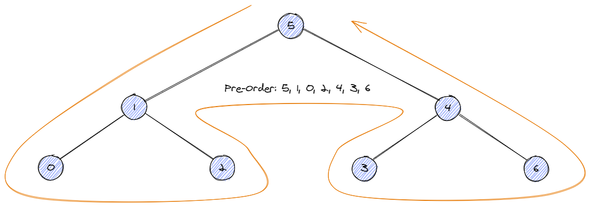
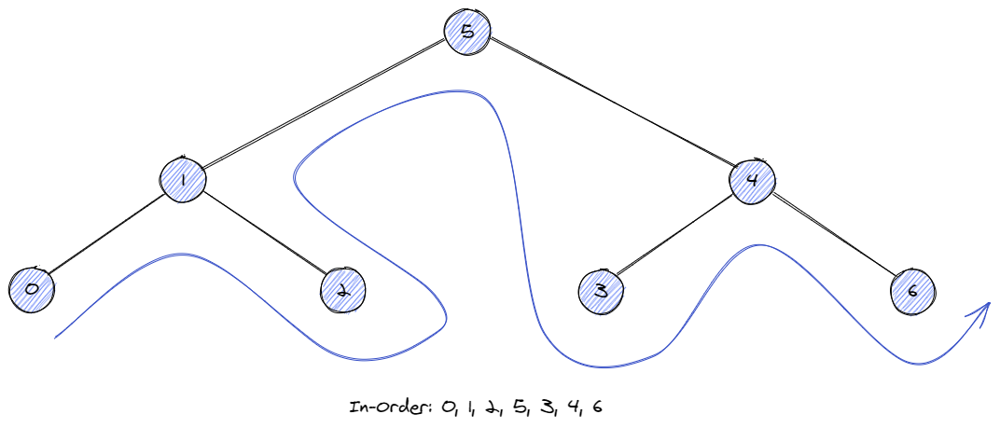
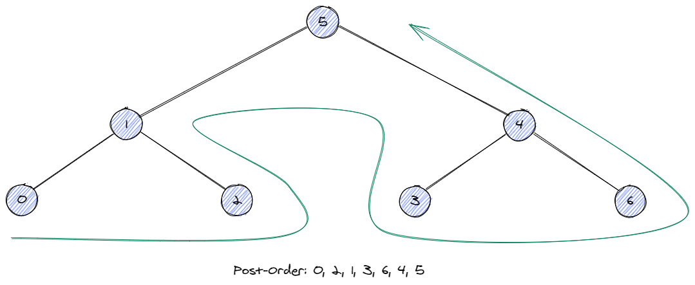
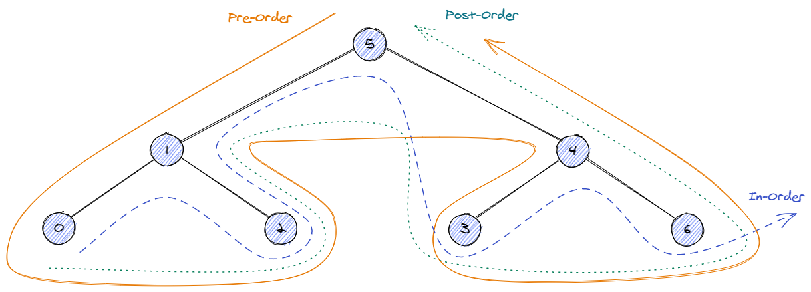

# Tree Traversal 

Tree traversal is critical for solving tree and graph related problems

Here are a few different ways to traverse a tree

- BFS (Level order)
- DFS
    - **preorder:** visit root first, then recursively do traversal of the left subtree,then a recursive traversal of the right subtree.
        - root -> left -> right
    - **inorder:** recursively do traversal on the left subtree, then the root node, and finally do traversal of the right subtree.
        - left -> root -> right
    - **postorder:** do traversal of the left subtree and the right subtree, finally to the root node.
        - left -> right -> root

To better understand this, here are some plots:

Pre-order



Pre-order



Pre-order



DFS Summary



## Template

### BFS

```python
def bfs_traverse(root):
    if not root:
        return []

    res = []
    queue = [root]  # Its better to use deque here, i.e. deque([root])
    while queue:
        level = []
        queue_size = len(queue)
        for i in range(queue_size):
            node = queue.pop(0)
            level.append(node.val)
            if node.left:
                queue.append(node.left)

            if node.right:
                queue.append(node.right)
        
        res.append(level)
    
    return res
```

### DFS

```python
# Recursive
def dfs_traverse(root):
    if not root:
        return

    # Pre-Order
    dfs_traverse(root.left)
    # In-Order
    dfs_traverse(root.right)
    # Post-Order

# Iterative
def preorder(root):
    stack = []
    res = []
    
    while root or stack:
        if root:
            res.append(root.val)
            stack.append(root)
            root = root.left
        elif stack:
            node = stack.pop()
            root = node.right
    
    return res

def inorder(root):
    stack = []
    res = []
    
    while root or stack:
        if root:
            stack.append(root)
            root = root.left
        elif stack:
            node = stack.pop()
            res.append(node.val)
            root = node.right

    return res

def postorder(root):
    """
    There are multiple ways to do a post order traversal iteratively, such as 
    using two stacks, one stack, reversing pre-order, or Morris traversal
    Here is a template for using one stack
    """
    stack = []
    res = []
    
    while stack or root:

        while root:
            if root.right:
                stack.append(root.right)
            stack.append(root)
            root = root.left

        root = stack.pop()

        if root.right and stack and stack[-1] == root.right:
            stack.pop()
            stack.append(root)
            root = root.right 

        else:
            res.append(root.val)
            root = None
    return res
```


Reference:

- [Iterative Postorder Traversal | Set 2 (Using One Stack)](https://www.geeksforgeeks.org/iterative-postorder-traversal-using-stack/)
- [Morris traversal (O(1) space pre-order traversal)](https://www.educative.io/edpresso/what-is-morris-traversal)
- [Leetcode Binary Tree](https://leetcode.com/explore/learn/card/data-structure-tree/)

Practice:

- [144. Binary Tree Preorder Traversal](https://leetcode.com/problems/binary-tree-preorder-traversal/)
- [94. Binary Tree Inorder Traversal](https://leetcode.com/problems/binary-tree-inorder-traversal/)
- [145. Binary Tree Postorder Traversal](https://leetcode.com/problems/binary-tree-postorder-traversal/)
- [102. Binary Tree Level Order Traversal](https://leetcode.com/problems/binary-tree-level-order-traversal/)
- [106. Construct Binary Tree from Inorder and Postorder Traversal](https://leetcode.com/problems/construct-binary-tree-from-inorder-and-postorder-traversal/)
- [105. Construct Binary Tree from Preorder and Inorder Traversal](https://leetcode.com/problems/construct-binary-tree-from-preorder-and-inorder-traversal/)
- [236. Lowest Common Ancestor of a Binary Tree](https://leetcode.com/problems/lowest-common-ancestor-of-a-binary-tree/)
- [297. Serialize and Deserialize Binary Tree](https://leetcode.com/problems/serialize-and-deserialize-binary-tree/)
